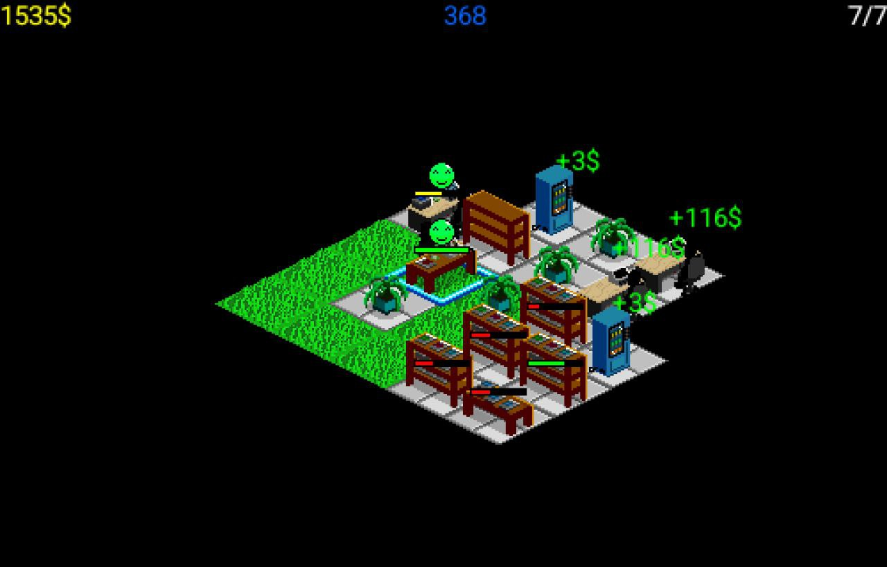

# How to build (Windows)
1. Clone the project
2. Download Wireless Toolkit from [Oracle website](https://www.oracle.com/java/technologies/java-archive-downloads-javame-downloads.html#sun_java_wireless_toolkit-2.5.2_01b-oth-JPR)  (Account is required)
 or here: [Github](https://github.com/j2me-preservation/j2me-preservation/blob/ce0adcf1dc94298d57576d51bf494f09300c3b43/SDK/sun_java_wireless_toolkit-2.5.2_01-win.exe). When installing make sure that you are using 32 bit jdk.
(I used [jdk-6u45-windows-i586.exe](https://www.oracle.com/java/technologies/javase-java-archive-javase6-downloads.html)), otherwise, it will give you   ```Can't load IA 32-bit .dll on a 64-bit platform``` error
 3. Install Net Beans IDE, i used 8.2 version. It is possible to build without IDE, but i haven't checked it yet. Open the project.
 4. Then just press run button

 # Useful links 
 - [Awesome J2ME](https://github.com/hstsethi/awesome-j2me)